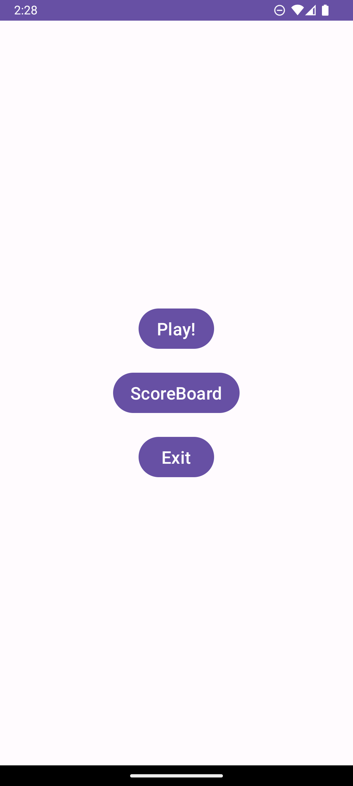

# Light-Up Puzzle Game - Small Android School Project

## Description
Light-Up is an Android puzzle game based on the Akari (Light-Up) logic puzzle. Players must place lights on a grid to illuminate all cells while following specific rules.

## Features
- Interactive puzzle grid with touch controls
- Room database for saving game progress
- Multiple difficulty levels
- Dynamic UI using Fragments
  
## Technologies Used
- **Kotlin** – Primary programming language
- **Room Database** – For local data storage
- **Fragments** – For modular UI design and navigation
- **Jetpack Navigation Component** – For fragment navigation

## How to Play
1. Tap on a cell to place or remove a light.
2. A light illuminates all cells in its row and column until blocked by a black cell.
3. Each numbered black cell must have exactly that many lights adjacent to it.
4. Solve the puzzle by lighting up all white cells without placing unnecessary lights.
5. Check your results with the Done! button.

## Preview

